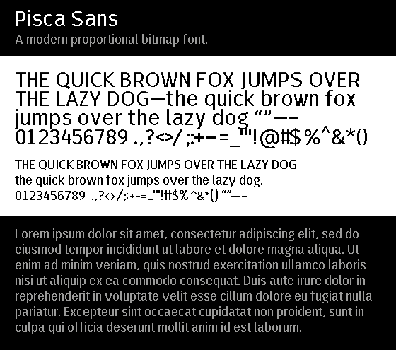

## Linux Install

### Fontconfig (TTF)

1. Enable bitmap fonts.
    - Fontconfig on newer systems may have bitmap fonts disabled by default.
      To change this setting go to `/etc/fonts/conf.d` and make sure that
      there is no file (or symlink to) `70-no-bitmap.conf` or similar.
2. Copy the `.ttf` files to a fontconfig directory, most likely:
    - `sudo cp *.ttf /usr/share/fonts/`
3. Rescan fontconfig directories:
    - `fc-cache -f`
4. Font name is `pisca Medium`. Use at either 12px or 19px.

### XLib (BDF/PFC)

1. Tell X where the fonts are.
    1. From a user directory:
        - `cd <repository_path>`
        - `mkfontdir`
        - `xset fp+ $HOME/<repository_path>`
        - `xset fp rehash`
    2. Or, you could copy the font files to the system directory:
        - `sudo cp *.pfc.gz /usr/share/fonts/misc`
2. Refer to the fonts as:
    1. PFC:
        - `-*-misc pisca-*-*-*-*-12-*-*-*-*-*-*-*`
    2. BDF:
        - `-*-pisca-*-*-*-*-12-*-*-*-*-*-*-*`

## About

This font roughly follows the metrics and style of [FiraGO](https://github.com/bBoxType/FiraGO).
